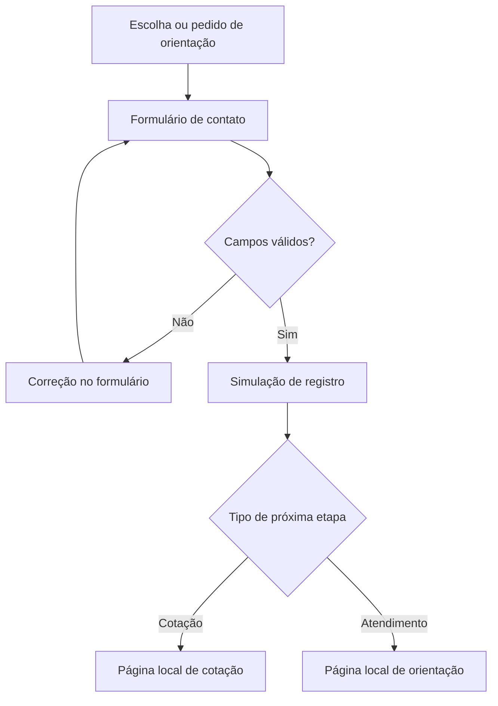

# Seguro IN — plano executável do protótipo

**Data da pesquisa:** 6 de setembro de 2026.  
**Entrega a implementar:** landing page estática responsiva, com nova identidade visual, seleção de seguro, formulário de lead e demonstração do encaminhamento para cotação ou atendimento.  
**Tecnologia:** HTML, CSS e JavaScript puro.  
**Público deste documento:** Codex executor, inclusive com modelo leve. As decisões de produto e direção visual estão tomadas abaixo.

## 0. Instrução inicial ao Codex

Leia este documento inteiro antes de implementar. Depois, leia os arquivos `AGENTS.md`, `README.md` e `CLAUDE.md` que já existirem no projeto e forem aplicáveis. Consulte a referência `frontend-design` indicada na seção 3. Execute as etapas da seção 15 na ordem, mantendo um checklist de progresso.

Implemente o protótipo completo; não entregue somente um esqueleto ou uma nova proposta de planejamento. Use os textos, os identificadores, as regras de comportamento e os tokens definidos aqui. Decida apenas detalhes pequenos que este documento não especificar e registre-os no README. Não acrescente frameworks, funcionalidades comerciais, promessas ou serviços por iniciativa própria.

O resultado deve permitir que uma pessoa navegue, escolha um seguro, preencha dados fictícios, veja validações, avance pelo fluxo e entenda a próxima etapa. **Nesta entrega, nenhum formulário deve enviar ou armazenar leads reais.** O encaminhamento será para uma segunda página estática local que representa o sistema de destino. A integração comercial real fica para depois da aprovação do protótipo.

O site atual não deve ser alterado. Trabalhe em uma pasta nova ou no diretório de protótipo indicado pelo usuário. A entrega pedida é local, sem publicação nem alteração de DNS.

## 1. Diagnóstico e decisões de produto

### 1.1 O que foi observado

Foram consultadas a [página inicial](https://seguroin.com.br/), a página de [produtos](https://seguroin.com.br/produtos) e a página de [solicitação de cotação](https://seguroin.com.br/solicitar-cota%C3%A7%C3%A3o), incluindo inspeção no navegador.

| Observação | Consequência para o novo protótipo |
| --- | --- |
| A abertura dedica muito espaço a uma fotografia de aperto de mãos e ao nome da marca. | Colocar a proposta de valor e a seleção de seguro na primeira tela. |
| A apresentação institucional antecede os produtos. | Mostrar primeiro o que o visitante pode fazer; resumir a apresentação institucional mais abaixo. |
| Há catálogo inicial, blocos individuais de simulação e outro catálogo de responsabilidades profissionais. Parte da estrutura reaparece em Produtos. | Unificar o catálogo em uma seção com três grupos e divulgação progressiva. |
| Existem links para ambientes externos de Porto, Argo e Suhai. | Usar um ponto comum de captação antes do encaminhamento. Preservar o inventário de destinos para futura validação. |
| A página de cotação usa um conteúdo incorporado e orienta o visitante a avisar pelo WhatsApp depois. | Dar feedback claro no próprio fluxo; não exigir uma segunda ação para comunicar que o formulário foi enviado. |
| O posicionamento menciona riscos corporativos, responsabilidade civil, patrimônio e riscos cibernéticos. | Manter uma entrada corporativa e profissional, além dos seguros pessoais. |

A home mediu aproximadamente **7.292 px de altura em uma janela de 1.363 × 936 px**, nesta sessão. É uma medição pontual, dependente do carregamento e do tamanho da janela. A proposta é reduzir principalmente repetição e dispersão de ações; não reduzir fontes para caber mais conteúdo.

O formulário de contato visível na home contém nome, e-mail e mensagem. O conteúdo completo do formulário incorporado na página de cotação não ficou disponível para inspeção; sua validação e seu funcionamento não foram testados. A leitura de links de saída também **não comprova que esses destinos continuam operacionais ou atribuídos comercialmente à corretora**.

### 1.2 Objetivo do novo site

O visitante deve entender rapidamente:

1. Que a Seguro IN é uma corretora e quais necessidades atende.
2. Como escolher o seguro desejado.
3. Por que informar um contato antes de continuar.
4. Se seguirá para uma cotação online ou para atendimento com um corretor.

**Conversão principal futura:** lead registrado com sucesso antes de sair para o ambiente de orçamento.  
**Conversão alternativa futura:** pedido de contato para quem precisa de orientação ou de uma análise especializada.

O protótipo valida a experiência dessas duas jornadas. Ele não calcula prêmio, não compara preços, não emite proposta comercial, não vende apólice e não confirma cobertura.

### 1.3 Premissas adotadas para destravar a execução

| Tema | Decisão para este protótipo |
| --- | --- |
| Marca | Manter o nome público **Seguro IN** e propor um novo desenho de marca. |
| Públicos | Pessoas, profissionais e empresas. |
| Ordem inicial | Começar com seguros pessoais, mantendo os outros dois públicos visíveis. É hipótese de navegação, não conclusão sobre faturamento ou demanda. |
| Sistema futuro de orçamento | Ainda não especificado; pode substituir ou unificar os destinos atuais. Usar um adaptador e destinos demonstrativos. |
| Produtos com links antigos | Ter uma demonstração de cotação; nenhum link antigo será ativado automaticamente. |
| Atendimento especializado | RC profissional, eventos, riscos corporativos, patrimônio empresarial e riscos cibernéticos seguem para atendimento demonstrativo. |
| Provas de confiança | Usar apresentação factual e contato; não inventar números, avaliações ou credenciais. |
| Fotografia | Não é dependência. A arte principal será um SVG original, descrito na seção 6. |

## 2. Referências pesquisadas e aplicação

As referências orientam decisões; não são modelos para copiar. A pesquisa não é uma comparação de preços, qualidade das coberturas ou confiabilidade comercial.

| Referência | Padrão observado | Aplicação na Seguro IN |
| --- | --- | --- |
| [Minuto Seguros](https://www.minutoseguros.com.br/) | Cotação em destaque na abertura, seleção de produto e explicação do processo. | Colocar uma ação concreta na primeira tela e oferecer orientação humana como alternativa. |
| [ComparaOnline](https://www.comparaonline.com.br/) | Produtos acessíveis na abertura e explicação de que o destino da contratação varia conforme o produto. | Escolher o produto antes de pedir dados e informar claramente a próxima etapa. |
| [Alper](https://www.alperseguros.com.br/) | Organização de soluções corporativas e pessoais, incluindo riscos especializados. | Preservar o posicionamento consultivo em um grupo próprio, sem reproduzir a extensão do portal. |

A composição inicial da Minuto e da Compara foi conferida visualmente. Na Alper, a consulta fundamenta sobretudo a taxonomia: parte do conteúdo visual do banner não carregou nesta sessão. Não se tomou esse carregamento parcial como defeito do site.

**Síntese do projeto:** facilidade para começar uma cotação, somada à clareza de uma corretora consultiva. A marca precisa parecer próxima e competente, adequada tanto a um seguro residencial quanto a uma conversa sobre risco profissional.

## 3. Referência obrigatória: frontend-design da Anthropic

Material consultado integralmente na elaboração deste plano:

- [SKILL.md no repositório anthropics/claude-code](https://github.com/anthropics/claude-code/blob/main/plugins/frontend-design/skills/frontend-design/SKILL.md).
- [Conteúdo bruto do mesmo arquivo](https://raw.githubusercontent.com/anthropics/claude-code/refs/heads/main/plugins/frontend-design/skills/frontend-design/SKILL.md).

Antes da interface, o executor deve ler esse material. O link acompanha a branch `main` e pode mudar; registrar no README a data da leitura e o commit, caso esteja disponível. É uma referência textual de design: não é necessário instalar o Claude Code ou um plugin para lê-la.

Diretrizes utilizadas: decisões visuais ligadas ao negócio; tipografia intencional; hierarquia que comunica função; conteúdo real; movimento discreto; uma assinatura visual; revisão do plano antes do código e autocrítica com screenshots. A identidade definida neste documento concretiza esses princípios. Não iniciar outra exploração estética. Se a consulta externa estiver indisponível, registrar isso e aplicar a direção já detalhada aqui, sem afirmar que releu o arquivo.

## 4. Catálogo consolidado e roteamento

### 4.1 Produtos, textos e identificadores

Usar exatamente os IDs abaixo em configuração, atributos HTML, estado e parâmetros da página demonstrativa. Os textos da coluna “Descrição” são propostas editoriais para o novo site, não transcrições do atual. São descrições gerais, sem garantia de cobertura.

| Grupo | ID | Nome público | Descrição no catálogo | Jornada demonstrativa |
| --- | --- | --- | --- | --- |
| Você | `auto` | Automóvel | Encontre opções para proteger seu carro e seguir com mais tranquilidade. | Cotação |
| Você | `residencial` | Residencial | Proteção para sua casa, seus bens e os imprevistos da rotina. | Cotação |
| Você | `vida` | Vida | Planeje proteção financeira para você e para quem conta com você. | Cotação |
| Você | `moto` | Moto | Escolha uma proteção que acompanhe você sobre duas rodas. | Cotação |
| Você | `viagem` | Viagem | Considere proteção para imprevistos antes de fazer as malas. | Cotação |
| Você | `celular` | Celular | Conheça opções de proteção para um item presente no seu dia a dia. | Cotação |
| Você | `bike` | Bike | Encontre opções para proteger sua bicicleta. | Cotação |
| Você | `roubo-furto` | Roubo e furto | Conheça essa alternativa de proteção para seu veículo. | Cotação |
| Sua profissão | `rc-profissional` | Responsabilidade civil profissional | Converse sobre os riscos da sua atividade e as opções de proteção. | Atendimento |
| Sua empresa | `patrimonial-empresarial` | Patrimônio empresarial | Avalie a proteção dos bens e das instalações da sua empresa. | Atendimento |
| Sua empresa | `riscos-corporativos` | Riscos corporativos | Conte com orientação para necessidades de proteção mais complexas. | Atendimento |
| Sua empresa | `cyber` | Riscos cibernéticos | Avalie riscos digitais e opções de proteção para o seu negócio. | Atendimento |
| Sua empresa | `eventos` | Eventos | Converse sobre as necessidades de proteção do seu evento. | Atendimento |

Observações de organização:

- O site atual usa “Patrimonial” em um item que aponta para residência. O protótipo distingue **Residencial** de **Patrimônio empresarial**; a abrangência empresarial deve ser validada antes da publicação.
- “Roubo e furto” é uma alternativa que pode se sobrepor a automóvel/moto, e não uma promessa de cobertura equivalente. Mantê-la entre as opções adicionais, sem presumir elegibilidade.
- “Eventos” aparece no bloco de RC do site atual. Aqui fica em “Sua empresa” para facilitar descoberta, mantendo atendimento especializado. Essa realocação é uma decisão de navegação.
- Corrigir “RC Proficional” para “Responsabilidade civil profissional”.
- Não acrescentar saúde, previdência, consórcio, pet, fiança ou qualquer produto não estabelecido neste escopo.

### 4.2 Profissões de RC

O formulário de RC terá um seletor de atividade com os seguintes pares ID/rótulo:

| ID | Rótulo |
| --- | --- |
| `advocacia` | Advocacia |
| `contabilidade` | Contabilidade |
| `corretagem-imoveis` | Corretagem de imóveis |
| `odontologia` | Odontologia |
| `engenharia-arquitetura` | Engenharia e arquitetura |
| `medicina` | Medicina |
| `corretagem-seguros` | Corretagem de seguros |
| `outra-profissao` | Outra profissão |

A última opção representa a entrada multiprofissional. Não solicitar inscrição de conselho, documentos ou detalhes de processos nesta etapa. Há atividade de corretagem de imóveis no catálogo antigo, mas não foi identificado um link correspondente no item inspecionado; isso não deve virar uma URL inventada. No seletor nativo, criar uma opção inicial vazia “Selecione sua atividade”, sem considerá-la uma nona atividade.

## 5. Arquitetura da landing page

### 5.1 Ordem e orçamento de conteúdo

Usar uma única landing page, com navegação por âncoras. A segunda página local existe apenas para demonstrar o encaminhamento. Não criar páginas separadas para cada seguro nesta entrega.

| Ordem | Bloco / ID | Conteúdo e limite |
| --- | --- | --- |
| 1 | Cabeçalho | Marca, três links de navegação e uma ação principal. |
| 2 | Abertura / `inicio` | Um H1, um parágrafo, seletor de seguro, CTA e arte. |
| 3 | Catálogo / `seguros` | Três grupos; inicialmente quatro opções pessoais. |
| 4 | Processo / `como-funciona` | Três passos, uma frase por passo. |
| 5 | Institucional / `sobre` | Um texto curto e três fatos/diferenciais sem métricas inventadas. |
| 6 | Dúvidas / `duvidas` | Cinco perguntas em acordeão, inicialmente fechadas. |
| 7 | Fechamento / `contato` | Um convite, CTA e contato no rodapé. |

Meta visual: aproximadamente **2.800–3.400 px de altura no desktop de 1.440 px**, com grupos adicionais e dúvidas fechados. É uma referência de concisão, não um limite que justifique ocultar informação necessária ou comprimir o texto. No celular, priorizar legibilidade; não impor a mesma altura.

### 5.2 Cabeçalho

- Altura de referência: 80 px no desktop e 64 px no celular, sem contar a faixa de demonstração.
- Container central de até 1.200 px.
- Marca à esquerda, largura aproximada de 160 px; links “Seguros”, “Como funciona” e “Sobre” à direita.
- Botão principal “Começar cotação”. Ele abre o mesmo fluxo usado na abertura.
- Cabeçalho `position: sticky; top: 0`; fundo branco opaco e borda inferior discreta.
- Abaixo de 960 px: marca, CTA compacto “Cotar” e botão de menu com rótulo acessível.
- Menu móvel expandido dentro do fluxo, logo abaixo do cabeçalho; sem gaveta lateral. Botão com `aria-expanded` e `aria-controls`. Fechar ao escolher um link ou pressionar Escape; devolver foco ao botão quando o fechamento for por Escape.
- Âncoras devem considerar a altura real do cabeçalho com `scroll-margin-top`, incluindo a faixa de demonstração.
- Redes sociais ficam apenas no rodapé, quando habilitadas futuramente.

### 5.3 Abertura: conteúdo exato

**H1:**

> Seguro para você, sua profissão e sua empresa.

**Parágrafo:**

> Escolha o que quer proteger e comece sua cotação. A Seguro IN ajuda você a entender as opções.

**Label do seletor:** “O que você quer proteger?”  
**Placeholder:** “Selecione um seguro”  
**CTA principal:** “Começar cotação”  
**Ação secundária:** “Prefiro falar com um corretor”  
**Texto de apoio:** “Primeiro, pedimos um contato. Depois, você segue para cotação ou atendimento, conforme o seguro.”

Composição desktop: duas colunas de proporção aproximada 58%/42%, intervalo de 48 px. Texto e ação à esquerda, SVG à direita. Alinhar pela região central, mantendo o H1 e o formulário visualmente dominantes.

O seletor contém todos os produtos, agrupados em `optgroup` com os três públicos. Não pré-selecionar um seguro. Ao clicar no CTA sem escolha, abrir o formulário e focar seu seletor de produto; não mostrar erro antes de interação. Com uma escolha, abrir o formulário já preenchido nesse produto e focar o nome.

No celular, a sequência é H1, parágrafo, seletor, CTA, ação secundária e arte. A arte fica reduzida a cerca de 190 px de altura. Em 390 × 844 px, buscar manter o CTA principal na primeira tela. Ajustar espaços e tamanho da arte antes de reduzir texto ou fonte.

### 5.4 Catálogo

**H2:** “O que você quer proteger?”  
**Apoio:** “Encontre seu seguro ou conte com a ajuda de um corretor para escolher.”

Três abas: “Para você”, “Sua profissão”, “Sua empresa”. A primeira começa ativa. Implementar o padrão de abas de modo consistente: `role=tablist`, `role=tab`, `aria-selected`, `aria-controls`, painéis associados e navegação por setas, Home e End. Só a aba ativa entra na sequência de Tab; todos os controles do painel visível continuam acessíveis.

**Para você:** mostrar Automóvel, Residencial, Vida e Moto em uma grade de duas colunas no desktop e uma no celular. Cada item é uma linha espaçosa, com ícone, título, descrição curta e ação “Começar cotação”. Usar divisores discretos; não transformar cada item em um grande cartão com sombra.

Após as quatro opções: botão “Ver mais seguros”, com `aria-expanded`, revela Viagem, Celular, Bike e Roubo e furto. Quando aberto, rótulo “Mostrar menos”. A visibilidade adicional pode ser preservada ao trocar de aba durante a sessão. Ao recolher, se o foco estiver no trecho removido, devolver ao botão expansor.

**Sua profissão:** um painel amplo com o nome completo de RC profissional, a descrição e botões compactos das oito atividades. Clicar em uma atividade abre o formulário com produto e profissão preenchidos. Também existe “Conversar sobre RC profissional”, que abre com atividade por escolher. Esses controles são botões reais, não etiquetas decorativas.

**Sua empresa:** quatro itens, com ícones consistentes, descrição e ação “Falar com um corretor”. A ação mantém o produto escolhido no formulário.

Não mostrar preços fictícios, selo “mais vendido”, rankings, quantidade de seguradoras ou indicação de disponibilidade online real.

### 5.5 Processo

**H2:** “Da escolha ao próximo passo.”

| Passo | Título | Texto exato |
| --- | --- | --- |
| 1 | Escolha seu seguro | Conte o que você quer proteger. |
| 2 | Deixe seu contato | Informe como podemos ajudar com sua solicitação. |
| 3 | Continue com orientação | Siga para a cotação online ou converse com um corretor, conforme o produto. |

Usar lista ordenada. Três colunas no desktop; lista vertical no celular. A numeração se justifica porque representa uma sequência. Não colocar números decorativos nas demais seções.

### 5.6 Institucional e confiança

**H2:** “Uma corretora para orientar sua escolha.”

**Texto:**

> A Seguro IN atende pessoas, profissionais e empresas. Sua atuação inclui proteção patrimonial, responsabilidade civil e riscos corporativos e cibernéticos, com atendimento para entender cada necessidade.

Três itens curtos, sem cartões flutuantes:

- **Atendimento humano:** “Converse com um corretor sobre suas dúvidas.”
- **Necessidades diferentes:** “Opções para a vida pessoal, a atividade profissional e o negócio.”
- **Contato acessível:** “Canais de contato reunidos em um só lugar.”

Não criar depoimentos, estrelas, certificações, tempo de mercado, quantidade de clientes ou prazo de resposta. Os destinos atuais evidenciam links de parceiros, mas não substituem a validação comercial. A faixa de logos de seguradoras fica **oculta por padrão**, com uma configuração para adicioná-la após confirmação e obtenção dos arquivos oficiais. Não exibir placeholders de logos ao visitante.

### 5.7 Dúvidas frequentes: conteúdo exato

Usar cinco elementos nativos `details`/`summary`. Permitir mais de um aberto; não escrever um novo componente de acordeão.

1. **Preciso saber qual seguro escolher?**  
   “Não. Se estiver em dúvida, escolha falar com um corretor e conte o que você precisa proteger.”
2. **Por que vocês pedem meu contato?**  
   “Para relacionar sua solicitação ao seguro escolhido e permitir que a equipe ajude com a cotação.”
3. **Vou continuar neste site?**  
   “Depende do produto. Algumas cotações seguem em outro ambiente; outras precisam de uma conversa com um corretor. Você verá o próximo passo antes de continuar.”
4. **Pedir uma cotação significa contratar?**  
   “Não. A solicitação inicia uma análise ou cotação. As condições e os próximos passos precisam ser apresentados antes da contratação.”
5. **Vocês atendem profissionais e empresas?**  
   “Sim. Acesse os grupos de profissão e empresa para encontrar as opções e solicitar orientação.”

Essas respostas são copy proposta para validação comercial. A faixa de protótipo e o aviso junto ao formulário esclarecem que nesta versão a solicitação é demonstrativa.

### 5.8 Fechamento e rodapé

**Título:** “Vamos encontrar seu próximo passo?”  
**Texto:** “Escolha um seguro ou fale com um corretor para começar.”  
**CTA:** “Começar cotação”  
**Alternativa:** “Falar com um corretor”.

Um bloco de fundo petróleo, sem uma segunda ilustração. Rodapé com marca, contato e aviso de privacidade do protótipo.

Dados encontrados no site atual, para reprodução textual e confirmação antes da publicação:

| Dado | Valor observado |
| --- | --- |
| Nome público | Seguro IN |
| Razão social apresentada | INFINNITY CORRETORA E ADM. DE SEGUROS LTDA. |
| Telefone / WhatsApp | (11) 97658-4982 |
| E-mail | contato@seguroin.com.br |
| Endereço | Avenida Tiradentes, 368, Centro, Guarulhos — SP |

Não completar o CEP truncado do site antigo, nem inferir horário de atendimento a partir do indicador “hoje”. Não inventar CNPJ ou registro SUSEP. No protótipo, telefone e e-mail aparecem como texto; a ação de contato abre o fluxo demonstrativo. A conexão efetiva dos canais fica no adaptador futuro.

## 6. Identidade visual, logo e arte

### 6.1 Direção fechada

**Conceito:** proximidade com precisão. Espaços claros, títulos firmes e um traço de proteção que aparece no símbolo e na arte da abertura. A continuidade com a marca antiga vem do nome e da família azul/turquesa; a tipografia inclinada e a fotografia de aperto de mãos serão substituídas.

Evitar escudo genérico, guarda-chuva, aperto de mãos, família de banco de imagens, cadeado 3D, mascote, fundos com gradientes decorativos, excesso de cartões e animações em todas as seções. A assinatura visual está na arte e na marca; o resto deve favorecer leitura e ação.

### 6.2 Tokens de cor

| Token | Valor | Uso |
| --- | --- | --- |
| `--color-ink` | `#123847` | Títulos, texto principal, fundo do fechamento. |
| `--color-brand` | `#076D79` | Botão principal, links e estados selecionados. |
| `--color-aqua` | `#89D7DE` | Áreas da ilustração e detalhes; não usar como texto sobre branco. |
| `--color-sun` | `#E6AE52` | Um detalhe pequeno da arte e indicação de demonstração com texto escuro. |
| `--color-canvas` | `#F4F8FA` | Fundo da abertura e de seções alternadas. |
| `--color-surface` | `#FFFFFF` | Fundo geral, campos e formulário. |

Tokens funcionais adicionais: `--color-muted: #4F6570`, `--color-border: #C6D5DA`, `--color-brand-hover: #055762`, `--color-error: #B42318` e `--color-success: #176B48`. Toda cor recorrente deve vir de variável CSS.

Combinações previstas: branco sobre petróleo ou `brand`; `ink` sobre branco, canvas, aqua e sun. Não escrever texto branco sobre aqua ou sun. Validar contraste no resultado final: 4,5:1 para texto normal e 3:1 para texto grande, conforme a [referência W3C](https://www.w3.org/WAI/WCAG22/Understanding/contrast-minimum.html).

### 6.3 Tipografia e medidas

- Títulos e marca textual: **Sora**, pesos 500 e 600.
- Corpo, navegação, botões e campos: **Source Sans 3**, pesos 400 e 600.
- Preferir WOFF2 locais e manter as licenças dos arquivos obtidos. Se não estiverem disponíveis, usar `system-ui, sans-serif` como fallback e registrar a pendência; nunca depender de uma fonte para o fluxo funcionar.
- `font-display: swap`. Não carregar cinco pesos por família.
- H1: `clamp(2.25rem, 4.2vw, 3.75rem)`, entrelinha 1,1, peso 600, tracking aproximado de -0,035em.
- H2: `clamp(1.75rem, 2.6vw, 2.5rem)`, entrelinha 1,18, peso 600.
- H3: 20–22 px, entrelinha 1,3.
- Corpo: 18 px desktop e 17 px celular, entrelinha 1,5.
- Formulário e botões: pelo menos 16 px, evitando zoom involuntário do navegador móvel em campos pequenos.
- Apoio e avisos: 14 px, entrelinha 1,45. Não resolver falta de espaço com texto de 10–12 px.
- Títulos e parágrafos alinhados à esquerda. Texto corrido com até aproximadamente 65 caracteres por linha.
- Não destacar uma palavra aleatória do H1 com outra cor, itálico ou degradê. O H1 funciona como uma unidade.

### 6.4 Espaçamento, forma e elevação

- Escala de espaços: 4, 8, 12, 16, 24, 32, 48, 64 e 80 px.
- Container: `max-width: 1200px`; margens laterais de 24 px no desktop e 20 px no celular; 16 px abaixo de 360 px.
- Seções principais: 72–80 px de padding vertical no desktop e 48 px no celular.
- Botões: altura mínima 48 px, raio 10 px, padding horizontal 22 px; usar altura mínima, não altura fixa que corte texto ampliado.
- Campos: altura mínima 52 px, raio 8 px, borda de 1 px; borda de foco mais evidente sem alterar o layout.
- Painel do formulário: raio 20 px e sombra suave única. Catálogo usa divisores e fundos simples.
- Não aplicar uma mesma sombra e um mesmo raio a tudo.

### 6.5 Novo logo proposto

Criar um **conceito de logo para revisão**, não alegar aprovação de identidade final ou exclusividade de marca.

Desenho principal: wordmark “seguro IN”, com “seguro” em minúsculas, “IN” em maiúsculas, na mesma linha e sem inclinação. Usar peso 600, espaçamento natural e cor petróleo. O “IN” pode usar `brand`; não separar visualmente como se fosse outra empresa.

Símbolo ao lado: monograma geométrico **IN**. Construção de referência em `viewBox="0 0 48 48"`: uma haste de I à esquerda; à direita, duas hastes e uma diagonal compondo N. Uma curva aberta no alto e na lateral esquerda enquadra o conjunto, sugerindo acolhimento sem formar escudo. Usar traços consistentes, terminais arredondados e espaços internos amplos. Simplificar a curva se a leitura a 24 px piorar.

Entregar `brand-mark.svg`, `logo.svg` e `favicon.svg`; a composição usada no cabeçalho pode combinar símbolo SVG e texto HTML para manter nitidez. Para o SVG completo, preferir letras em paths quando houver ferramenta apropriada; se usar `<text>`, garantir fallback e documentar. Evitar dependência externa de fonte dentro do favicon; nele usar só o símbolo.

Criar versão monocromática clara para o fundo petróleo. Testar em 16, 24 e 32 px no símbolo, e em cerca de 140–180 px no logo completo. Reservar espaço de proteção equivalente à largura da haste do símbolo multiplicada por dois. Não copiar marcas de corretoras pesquisadas.

### 6.6 Arte principal: especificação para SVG original

Criar `hero-protection.svg`, uma ilustração vetorial editorial, com `viewBox="0 0 560 460"`, sem texto embutido e sem filtros caros.

Composição fechada:

1. Um grande contorno aberto e arredondado, em petróleo, ocupa a região central e superior; retoma a curva de enquadramento do símbolo.
2. Dentro desse contorno, três volumes arquitetônicos compõem uma cena única: casa baixa à esquerda, um volume vertical de escritório ao fundo à direita e um pequeno carro na base. Não usar três cartões separados.
3. Casa em branco e aqua, com porta em petróleo. Escritório com quatro ou seis janelas simples, sem dezenas de detalhes. Carro em petróleo, com duas rodas e janela aqua.
4. Um pequeno círculo sun no alto à direita equilibra a cena; é o único destaque quente.
5. Uma linha de base integra os objetos; deixar pelo menos 10% de respiro nas bordas. Não criar etiquetas flutuantes, preços, selos ou textos sobre a cena.

Usar no máximo as seis cores base. A ilustração deve representar proteção da vida e do trabalho, com formas legíveis a 280 px de largura. É decorativa: `alt=""` quando inserida como imagem; `aria-hidden="true"` se inline. A oferta está expressa no HTML, não depende da imagem.

Não é necessário gerar fotografias por IA. Se futuramente o usuário solicitar uma variante fotográfica, isso será uma revisão específica; a primeira implementação mantém esta arte vetorial.

### 6.7 Ícones e movimento

- Ícones de 24 ou 28 px, mesmo traço de aproximadamente 1,8–2 px, sem emojis. Criar SVGs simples próprios; não introduzir pacote de componentes só para ícones.
- Produto: carro, casa, pessoa, moto, mala, celular, bicicleta, veículo protegido, pasta profissional, edifício, estrutura corporativa, computador e calendário de evento.
- A diferença entre produtos deve permanecer legível pelo título, mesmo que dois ícones sejam parecidos.
- Transições de cor e abertura: 160–220 ms. A arte pode ter uma única entrada discreta de opacidade; nenhum movimento em loop.
- Sem parallax, cursor personalizado, contador animado ou efeito de digitação.
- Respeitar `prefers-reduced-motion`; o conteúdo nunca pode depender de uma animação para aparecer.

## 7. Formulário e jornadas de conversão

### 7.1 Um único componente de captação

Todas as chamadas comerciais da landing page usam o mesmo formulário. A origem do clique e o produto são parâmetros; não criar um formulário diferente por seção ou por seguro.

Usar um elemento nativo `dialog`, aberto com `showModal()`, conforme a [documentação do MDN](https://developer.mozilla.org/en-US/docs/Web/HTML/Reference/Elements/dialog). No desktop, largura máxima de 560 px e altura máxima de `calc(100dvh - 48px)`, com rolagem interna. Abaixo de 640 px, ocupar a tela disponível, com conteúdo rolável e respeito às áreas seguras do aparelho. Não criar uma camada de modal artesanal com tratamento de foco incompleto.

Um título visível dá nome ao diálogo via `aria-labelledby`. Botão de fechar de pelo menos 44 × 44 px no canto superior. Escape fecha. O foco volta ao acionador, desde que ele continue visível; caso contrário, vai para a ação principal da abertura. Bloquear a rolagem do documento enquanto o diálogo estiver aberto.

Não fechar por clique no fundo: isso evita perda acidental do preenchimento. Fechar pelo botão ou por Escape não apaga o rascunho durante a sessão. Não abrir um diálogo sobre outro: o aviso de privacidade dentro do formulário deve expandir ali mesmo.

### 7.2 Modos e entrada

| Origem | Produto inicial | Intenção | Primeiro foco |
| --- | --- | --- | --- |
| CTA da abertura com seleção | Selecionado | Cotação | Nome |
| Cabeçalho, fechamento ou abertura sem seleção | Última escolha, se houver | Cotação | Produto, se ainda vazio; senão nome |
| Item de seguro pessoal | ID do item | Cotação | Nome |
| Atividade de RC | `rc-profissional` + atividade | Cotação com atendimento especializado | Nome |
| Produto empresarial | ID do item | Cotação com atendimento especializado | Nome |
| “Prefiro falar com um corretor” | Última escolha, se houver | Contato | Nome |

Na intenção **Contato**, o produto é opcional. Acrescentar apenas nesse seletor a opção “Preciso de orientação”, com valor vazio. Não criar um décimo quarto produto para isso. Na intenção **Cotação**, o produto é obrigatório.

O produto selecionado no formulário atualiza a escolha da abertura. Trocar a aba do catálogo, sozinho, não altera um produto já escolhido.

### 7.3 Campos, ordem e validação

**Título para cotação:** “Comece sua cotação.”  
**Título para contato:** “Converse com um corretor.”

**Apoio para produto com jornada de cotação:** “Deixe um contato antes de seguir para o ambiente de cotação.”  
**Apoio para jornada de atendimento:** “Deixe um contato para conversar sobre o seguro escolhido.”

Ordem fixa dos campos:

| Campo | Exigência | Comportamento |
| --- | --- | --- |
| Seguro | Obrigatório na intenção Cotação; opcional em Contato | `select` agrupado; opção selecionada sempre visível e editável. |
| Atividade profissional | Obrigatório quando o produto for RC profissional | Mostrar somente para RC; incluir “Outra profissão”. |
| Seu nome | Obrigatório | `autocomplete=name`; aceitar nomes com acentos, espaços, hífen e apóstrofo, sem exigir sobrenome. |
| WhatsApp com DDD | Obrigatório | `type=tel`, `inputmode=tel`, `autocomplete=tel`; aceitar digitação e colagem com ou sem máscara. |
| E-mail (opcional) | Validar somente se preenchido | `type=email`, `autocomplete=email`; não exigir e-mail para avançar. |
| Autorização de contato | Obrigatória para simular o pedido | Checkbox desmarcado: “Pode me contatar sobre esta solicitação.” |

Não pedir CPF, CNPJ, placa, endereço, data de nascimento, documentos, informações de saúde, renda, detalhes de sinistro ou uma mensagem longa. Os dados específicos do seguro pertencem à etapa posterior.

Regras de validação:

- Nome: trim, de 2 a 100 caracteres; rejeitar entrada apenas numérica. Não usar regex que exclua caracteres legítimos de nomes.
- Telefone: limpar separadores; retirar o prefixo internacional `55` somente quando o total tiver 12 ou 13 dígitos; depois aceitar 10 ou 11 dígitos nacionais. Rejeitar repetição do mesmo dígito. Isso verifica formato, não existência de conta no WhatsApp.
- Normalizar o telefone válido como `+55` seguido dos dígitos nacionais no payload em memória. Nunca perder dígitos ao formatar visualmente.
- E-mail: validação nativa de formato, até 254 caracteres; vazio é válido.
- Atividade: descartar o valor do payload quando o produto deixar de ser RC.
- Autorização: desmarcada por padrão; não equivale a autorização para propaganda. Trata-se de copy de protótipo, a ser revisada no fluxo real.
- Validar no primeiro envio e depois ao sair de campos já editados. Não mostrar todos os campos em vermelho ao abrir.
- Usar erro textual junto ao campo, `aria-invalid` e `aria-describedby`. No envio inválido, focar o primeiro erro. Manter o botão habilitado enquanto a pessoa preenche; desabilitar somente durante a simulação em andamento.

Mensagens exatas de erro:

| Situação | Mensagem |
| --- | --- |
| Sem produto obrigatório | “Selecione o seguro que você procura.” |
| Sem atividade de RC | “Selecione sua atividade profissional.” |
| Nome vazio, curto ou apenas numérico | “Informe seu nome, com pelo menos 2 caracteres.” |
| Nome com mais de 100 caracteres | “Use até 100 caracteres para informar seu nome.” |
| Telefone inválido | “Informe um telefone com DDD, com 10 ou 11 dígitos.” |
| E-mail inválido | “Confira o formato do e-mail ou deixe este campo em branco.” |
| Autorização desmarcada | “Autorize o contato sobre esta solicitação para continuar.” |

Botão de envio: **“Continuar”**. Próximo ao botão, usar: “Protótipo: use dados fictícios. Nenhuma solicitação será enviada.”

### 7.4 Privacidade demonstrativa

Link “Como seus dados seriam usados?” expande uma área de texto dentro do formulário:

> Esta é uma demonstração. Os dados preenchidos ficam apenas na memória desta página e não são enviados à Seguro IN ou a seguradoras. Na versão publicada, o aviso deverá explicar como os dados serão usados para atender à solicitação e como entrar em contato sobre privacidade.

No rodapé, “Privacidade do protótipo” abre o mesmo diálogo em uma visualização apenas informativa, sem campos. O cabeçalho do site terá uma faixa discreta “Protótipo demonstrativo. Use dados fictícios.” Não apresentar este texto como política definitiva, nem exibir um banner de cookies sem necessidade funcional.

### 7.5 Estados e transições

Implementar estados explícitos, com nomes simples. O estado `success` significa sucesso da **simulação**, nunca confirmação de recebimento pela corretora.

| Estado | Interface | Transição |
| --- | --- | --- |
| `editing` | Formulário habilitado, escolhas e rascunho atuais. | Envio válido leva a `submitting`. |
| `invalid` | Formulário com erros localizados, sem apagar dados. | Correção e reenvio; equivale à edição com erros. |
| `submitting` | Botão “Preparando próxima etapa…” e indicador de atividade; `aria-busy=true`. | Adaptador demonstrativo resolve em cerca de 600 ms, ou gera o erro configurado. |
| `success` | Resumo do produto e indicação da próxima etapa; link de continuação. | Clique explícito abre a página local de destino. |
| `error` | Erro junto da ação, com dados mantidos. | “Tentar novamente” repete a simulação. |

Erro simulado: “Não foi possível continuar. Seus dados permanecem no formulário. Tente novamente.”

Para **cotação online demonstrativa**, no sucesso:

- Título: “Continue sua cotação.”
- Texto: “Na próxima etapa, você informará os dados específicos do seguro escolhido.”
- Aviso discreto: “Fluxo demonstrativo. Nenhum dado foi enviado.”
- Link principal: “Continuar para cotação”.

Para **atendimento demonstrativo**, no sucesso:

- Título: “O próximo passo é conversar.”
- Texto: “Este pedido segue com orientação de um corretor.”
- Aviso discreto: “Fluxo demonstrativo. Nenhum atendimento foi solicitado.”
- Link principal: “Ver próximo passo”.

Os dois estados oferecem “Alterar informações”, retornando à edição. Não usar “Lead salvo”, “Pedido recebido”, protocolo de atendimento real, preço, prazo de resposta ou confirmação de contratação.

Se o diálogo for fechado durante a espera, invalidar a operação pendente por um contador de tentativa ou token. O resultado antigo não pode reabrir o diálogo nem sobrescrever uma sessão posterior. Manter o rascunho apenas enquanto a página continuar aberta.

### 7.6 Fluxo visual de referência



## 8. Página local de próxima etapa

Criar **`proxima-etapa.html`**. A mesma página suporta as duas jornadas. Não tentar reproduzir os sistemas de Porto, Argo, Suhai ou qualquer cotador real.

O link de sucesso usa apenas parâmetros controlados:

- Cotação: `proxima-etapa.html?fluxo=cotacao&produto=auto`.
- Atendimento especializado: `proxima-etapa.html?fluxo=atendimento&produto=cyber`.
- Contato sem produto: `proxima-etapa.html?fluxo=atendimento`.
- RC pode acrescentar `atividade=medicina`, usando exclusivamente os IDs do catálogo.

Esses exemplos são rotas locais projetadas, não endereços de serviços já existentes. Construir a query com `URLSearchParams`. Nunca colocar nome, telefone, e-mail, autorização, JSON do formulário ou um payload codificado na URL.

Composição da página: marca, faixa de demonstração, painel central de até 680 px, título, produto/atividade quando válidos, uma explicação curta e um link para voltar.

**Se `fluxo=cotacao`:**

- Título: “Aqui começaria a cotação de [produto].”
- Explicação: “No site publicado, você continuaria no ambiente de cotação indicado pela Seguro IN. Esta tela demonstra apenas o encaminhamento.”
- Não mostrar formulário de seguro, preço simulado ou lista de seguradoras.

**Se `fluxo=atendimento`:**

- Título: “Aqui começaria o atendimento.”
- Explicação: “No site publicado, sua solicitação seria encaminhada para orientação sobre o seguro escolhido. Nenhum contato foi solicitado nesta demonstração.”

Botão em ambos: “Voltar para Seguro IN”, apontando para `index.html#seguros`. Para simular uma saída real sem pop-ups, navegar na mesma aba. Não assumir que o rascunho de contato permanecerá ao navegar entre páginas ou recarregar.

Validar parâmetros contra os IDs permitidos. `fluxo=cotacao` exige um produto cuja jornada seja `quote`. `fluxo=atendimento` aceita qualquer produto válido ou nenhum produto, pois também atende quem pede orientação. Atividade é válida somente para RC e deve pertencer à lista da seção 4.2; sua ausência não impede a tela demonstrativa de atendimento. Com fluxo desconhecido, produto desconhecido, combinação inválida ou falta de produto exigido, mostrar “Escolha um seguro para continuar” e o link de volta. Ignorar parâmetros extras. Não usar `innerHTML` para inserir parâmetros. A página também deve funcionar quando aberta diretamente, sem uma passagem anterior pelo formulário.

## 9. Responsividade e acessibilidade

### 9.1 Layout por largura

| Faixa | Comportamento |
| --- | --- |
| Abaixo de 640 px | Uma coluna, ações com largura confortável, diálogo de tela inteira, arte reduzida, catálogo empilhado. |
| 640–959 px | Abertura ainda em uma coluna; catálogo em duas; formulário centralizado. |
| A partir de 960 px | Abertura em duas colunas, menu completo, processo em três colunas. |
| Acima de 1440 px | Container permanece em 1200 px; não esticar textos até as bordas. |

As três abas cabem na largura móvel, com texto de no mínimo 14 px. Permitir quebra controlada em duas linhas se necessário; não esconder a terceira opção atrás de uma rolagem horizontal pouco evidente. Não trocar a ordem das categorias.

Não haverá barra flutuante inferior ou bolha de WhatsApp nesta primeira versão. O cabeçalho e os CTAs contextuais já oferecem acesso; evitar sobreposição com teclado, formulário e rodapé. Essa decisão também reduz distrações no protótipo.

### 9.2 Requisitos verificáveis

- `lang=pt-BR`, um único H1 por página e hierarquia H2/H3 consistente.
- Landmarks semânticos `header`, `nav`, `main` e `footer`; link “Pular para o conteúdo”.
- Botões para abrir/trocar/confirmar; links para navegar. Nenhum `div` clicável substituindo controle.
- Labels permanentes nos campos. Placeholder não substitui label.
- Foco visível em todos os controles; não depender só de mudança de cor para seleção ou erro.
- Área de interação com pelo menos 44 × 44 px para ícones e controles compactos.
- Conteúdo e navegação utilizáveis com teclado. Diálogo, menu e abas precisam de revisão específica.
- Estados de envio e resultado anunciados em região `aria-live=polite`; erros urgentes sem anunciar a cada tecla.
- Sem rolagem horizontal em 320 px. Usar `min-width: 0` em filhos de grid/flex quando necessário.
- Texto ampliado a 200% sem corte de botões, campos ou navegação; nenhuma altura rígida em blocos de texto.
- Diálogo utilizável com teclado virtual aberto. A ação final deve ser alcançável por rolagem.
- Mensagem `noscript` objetiva: “Ative o JavaScript para experimentar a cotação demonstrativa.” O conteúdo institucional e o catálogo principal permanecem legíveis.

## 10. Estrutura técnica e responsabilidades

### 10.1 Arquivos a entregar

Não usar React, Vue, Next, Angular, Tailwind, Bootstrap, jQuery ou biblioteca de formulário. Não criar API, banco, login, Docker, pipeline ou CMS nesta fase. Um servidor de arquivos para pré-visualizar não é um backend de leads.

| Arquivo | Responsabilidade |
| --- | --- |
| `index.html` | Conteúdo semântico completo da landing page, catálogo visual, diálogo e templates de estados. |
| `proxima-etapa.html` | Tela local que demonstra cotação ou atendimento. |
| `assets/css/styles.css` | Tokens, base, layout, componentes, estados e media queries. |
| `assets/js/config.js` | Configuração da marca, modo demonstrativo e opções de QA. |
| `assets/js/catalog.js` | IDs, rótulos, grupos, jornadas e atividades; fonte única dos seletores e do roteamento. |
| `assets/js/lead-adapter.js` | Contrato de envio e implementação exclusivamente simulada. |
| `assets/js/app.js` | Menu, abas, formulário, foco, validação, estados e montagem do link local. |
| `assets/js/next-step.js` | Leitura validada dos parâmetros da página demonstrativa. |
| `assets/img/brand-mark.svg` | Símbolo de marca. |
| `assets/img/logo.svg` | Conceito de logo completo. |
| `assets/img/favicon.svg` | Símbolo simplificado para aba. |
| `assets/img/hero-protection.svg` | Arte original da abertura. |
| `assets/fonts/` | Fontes locais e licenças, quando obtidas. |
| `README.md` | Execução, estrutura, decisões, testes realizados e pontos de integração. |
| `qa/` | Screenshots de revisão, se o ambiente tiver navegador disponível. |

É permitido manter pequenos ícones inline no HTML em vez de gerar treze arquivos. Não criar uma arquitetura de plugins para um protótipo pequeno.

### 10.2 Carregamento e organização

- Usar scripts clássicos com `defer`, na ordem `config`, `catalog`, `lead-adapter`, `app` na landing page.
- Na próxima etapa, carregar `config`, `catalog` e `next-step`.
- Envolver cada arquivo em função isolada e compartilhar somente um namespace `window.SeguroIN`.
- Não usar módulos ES nem `fetch` para carregar o catálogo, para permitir abertura por `file://` além de servidor estático.
- Deixar no HTML as seções, os textos principais e o catálogo visível. O JavaScript conecta ações e gera os seletores a partir dos metadados. Conferir a igualdade entre rótulos do HTML e do catálogo.
- Usar `data-product-id`, `data-entry-point` e `data-action` para eventos; classes CSS cuidam de estilo. Evitar seletores JavaScript baseados no texto de botões.
- Registrar listeners uma vez; reabrir o formulário não pode duplicar envios.
- Inicializar o rascunho vazio e limpar os campos na carga inicial para não depender de restauração automática do formulário pelo navegador. Reabrir o diálogo na mesma página preserva o estado já editado.
- Usar `<template>` e `textContent` para conteúdo dinâmico. Evitar montagem de HTML a partir de campos, URLs ou query strings.
- Organizar CSS em ordem: tokens, reset mínimo, tipografia, layout, componentes, estados, responsividade. Evitar `!important` e seletores amplos que alterem seções sem intenção.

### 10.3 Configuração de referência

Este trecho define o formato esperado, não implementa o site inteiro:

```js
window.SeguroIN = window.SeguroIN || {};

window.SeguroIN.config = {
  prototypeMode: true,
  demoDelayMs: 600,
  demoFailureOnce: false,
  debugEvents: false,
  nextStepPath: "proxima-etapa.html",
  showInsurerLogos: false,
  contact: {
    phoneDisplay: "(11) 97658-4982",
    whatsappDigits: "5511976584982",
    email: "contato@seguroin.com.br"
  },
  integrations: {
    leadEndpoint: null,
    quoteDestinations: {},
    contactDestination: null
  }
};
```

Os dados de contato acima são de exibição; não chamar os canais a partir do formulário. Os campos de integração permanecem vazios nesta entrega. **Alterar `prototypeMode` para `false` não transforma o protótipo em um sistema pronto para produção.** Se isso acontecer sem um adaptador real implementado, interromper apenas o envio com mensagem de configuração indisponível; não fingir sucesso nem enviar dados para um endereço improvisado.

Cada entrada de catálogo deve ter `id`, `label`, `group` e `journey`, usando `group` igual a `personal`, `professional` ou `business`, e `journey` igual a `quote` ou `assisted`. A jornada final é `assisted` quando a intenção for Contato, mesmo que o produto normalmente tenha cotação.

### 10.4 Contrato do adaptador

Interface esperada: `leadAdapter.submit(payload)`, que retorna uma Promise. Payload mínimo em memória:

```js
{
  intent: "quote", // "quote" ou "contact"
  productId: "auto", // null permitido somente em contact
  activityId: null,
  name: "Pessoa de Teste",
  phone: "+5511999999999",
  email: "teste@example.com", // null se vazio
  contactPermission: true,
  entryPoint: "hero" // hero, header, catalog, footer ou assistance
}
```

Os valores do exemplo são fictícios e não devem ser preenchidos automaticamente para visitantes. A simulação devolve `{ ok: true, simulated: true }` após o atraso configurado. Com `demoFailureOnce=true`, a primeira tentativa válida falha de forma controlada; a segunda funciona. Essa opção existe só em configuração, sem um painel técnico visível ao visitante.

Não criar envio por `fetch`, webhook, serviço de formulário, e-mail ou WhatsApp nesta implementação. Não usar `localStorage`, `sessionStorage`, cookies, IndexedDB ou logs para guardar contatos. O rascunho vive exclusivamente no objeto de estado da página; recarregar o documento reinicia a experiência.

Para depurar conversão, `debugEvents=true` pode registrar apenas eventos `cta_click`, `lead_form_open`, `lead_submit_attempt`, `lead_submit_success_demo`, `lead_submit_error_demo` e `next_step_click`, com produto e origem do clique. Nunca registrar o payload, dados pessoais ou a URL completa. Não carregar ferramentas externas de analytics no protótipo.

## 11. Contrato para a integração real posterior

Esta seção documenta a evolução, não é uma tarefa de backend para o executor do protótipo.

Na versão real, o adaptador deverá gravar o lead em um serviço controlado pela operação e aguardar confirmação. Só depois a interface pode disponibilizar ou executar o encaminhamento. Preencher formulário e colocar os dados em armazenamento do navegador não significa captar um lead para a corretora.

Contrato conceitual de resposta futura:

```json
{
  "ok": true,
  "leadId": "identificador-opaco",
  "nextStep": "quote",
  "redirectUrl": "URL-validada-pelo-servidor"
}
```

O servidor futuro precisa decidir o destino conforme produto e atividade, preservar a atribuição da corretora e devolver uma URL validada. O frontend não deve aceitar um destino arbitrário vindo da query string do visitante.

Pontos que precisam de solução real antes de ativar:

1. Onde o lead é recebido e quem o acompanha.
2. Quais produtos o cotador efetivamente atende; quais ficam com um corretor.
3. Como manter identificação comercial e, se suportado, associar lead e orçamento por referência opaca.
4. O que acontece quando o registro falha, quando o cotador falha ou quando o usuário tenta duas vezes.
5. Aviso de uso de dados, dados cadastrais da corretora e canais de contato confirmados.

Não prometer transferência automática dos campos para o cotador: isso depende do contrato técnico desse sistema. Não transmitir contato em parâmetros de URL. Se houver erro de registro, manter dados na tela e oferecer nova tentativa, sem dizer que a solicitação foi recebida. O envio real deve tratar repetição de tentativas sem criar pedidos duplicados.

O evento de saída para o cotador também não prova emissão de orçamento ou contratação. Essa medição futura depende de retorno do sistema parceiro.

## 12. Links legados: inventário para migração

Estes endereços foram observados nos links do site atual. **Não foram submetidos formulários nem validada sua operação ponta a ponta.** Copiá-los para configuração ativa exige conferir destino final, vigência, produto e identificação da corretora. Os parâmetros comerciais existentes não devem ser descartados sem análise.

| Produto | Endereço observado |
| --- | --- |
| Automóvel | `https://wwws.portoseguro.com.br/vendaonline/home.ns?cod=d0a25952332046d492fb487ba9bb52d8&utm_source=XH926J&utm_medium=geradorLinks&utm_campaign=GeradordeLinks_IE04YJ&utm_content=INFINNITY_SEGUROS` |
| Vida | `https://wwws.portoseguro.com.br/vendaonline/vidamaissimples/home.ns?cod=f22f561f37ef4c08be59c26aa77ab5b6&utm_source=XH926J&utm_medium=geradorLinks&utm_campaign=GeradordeLinks_IE04YJ&utm_content=I` |
| Residencial | `https://wwws.portoseguro.com.br/vendaonline/residencia/home.ns?cod=a8f2482fcd124e389458fd83c0b675a1&utm_source=XH926J&utm_medium=geradorLinks&utm_campaign=GeradordeLinks_IE04YJ&utm_content=INFINNITY_SEGUROS` |
| Viagem | `https://wwws.portoseguro.com.br/vendaonline/viagem/home.ns?cod=91b58376ac2841c496a4cedb02dd81fa&utm_source=XH926J&utm_medium=geradorLinks&utm_campaign=GeradordeLinks_IE04YJ&utm_content=INFINNITY_CORRETORA` |
| Moto | `https://wwws.portoseguro.com.br/vendaonline/moto/home.ns?cod=85eaebbd8b004f62816973149c520960&utm_source=XH926J&utm_medium=geradorLinks&utm_campaign=GeradordeLinks_IE04YJ&utm_content=INFINNITY_SEGUROS` |
| Celular / equipamentos portáteis | `https://wwws.portoseguro.com.br/vendaonline/equipamentosportateis/home.ns?cod=c295a1e1360842698ada053838f6d37f&utm_source=XH926J&utm_medium=geradorLinks&utm_campaign=GeradordeLinks_IE04YJ&utm_content=INFINNITY_SEGUROS` |
| Bike | `https://www.argo-protector.com.br/v2/Products/Bikes/corretor/infinnitycorretoraeadm/bikes1` |
| Roubo e furto / Suhai | `http://suhai.link/prl1` |

As campanhas de RC e eventos observadas usam este prefixo exato:

```text
http://www.argo-protector.com.br/campanha/infinnitycorretoraeadm/
```

| Categoria original | Sufixo observado após o prefixo |
| --- | --- |
| Advogados | `advogados1` |
| Contabilistas | `contabilistas1` |
| Dentistas | `dentistas1` |
| Engenheiros e arquitetos | `engenheirosearq1` |
| Médicos | `medicos1` |
| Eventos | `eventos1` |
| Corretores de seguros | `corretores1` |
| Multiprofissionais | `multiprofissionais1` |

Também foram encontrados um link curto geral de solicitação, `http://bit.ly/2zsqoya`, e o destino de WhatsApp `https://wa.me/5511976584982`. O destino final do link curto não foi validado. Não supor que ele seja a nova integração desejada.

Nos links HTTP, confirmar se existe destino HTTPS oficial antes de migrar; não simplesmente trocar o protocolo e presumir sucesso. Não transportar o formulário incorporado antigo para a landing page nova.

## 13. Desempenho, execução e acabamento técnico

- O protótipo deve abrir diretamente por `index.html`. Também documentar a execução com `python3 -m http.server 8080`, a partir da raiz da pasta, e abertura de `http://localhost:8080`.
- Nenhuma instalação de pacote é necessária para a experiência funcionar. Ferramentas de QA já disponíveis podem ser usadas, sem criar uma cadeia de build obrigatória.
- Manter recursos de interface locais. Não fazer hotlink de arte, logo ou imagem do site antigo ou das referências.
- Definir largura/altura ou `aspect-ratio` para a ilustração e símbolos para evitar saltos de layout.
- Evitar imagens raster nesta entrega. Meta de peso total dos recursos locais: até aproximadamente 1 MB, incluindo fontes; se ultrapassar, explicar e otimizar o maior recurso primeiro.
- Console sem erros e nenhum caminho relativo quebrado. Recursos precisam continuar funcionando quando a pasta é servida em um subdiretório.
- Sem `alert()` para feedback e sem telas vazias durante carregamento.
- Título da landing: “Seguro IN | Seguros para você, sua profissão e sua empresa”. Descrição coerente com a proposta. Usar favicon local.
- Marcar ambas as páginas do protótipo com `meta name=robots` e `content=noindex,nofollow`. Isso sinaliza que são demonstrações; não é controle de acesso.
- Evitar metadados de preço, avaliação ou dados estruturados comerciais inventados. SEO de produção e URLs definitivas ficam para a fase posterior.

## 14. Critérios de aceite e roteiro de revisão

### 14.1 Aceite visual

- [ ] O visitante encontra a escolha de seguro e a ação principal antes de conteúdo institucional longo.
- [ ] A marca nova tem versões legíveis em fundo claro e escuro.
- [ ] As fontes, as cores, a forma dos controles e os espaços seguem a seção 6.
- [ ] A arte é original, usa o motivo de proteção e não parece um elemento solto sem relação com a marca.
- [ ] A landing não reproduz a sequência de grandes blocos por produto do site antigo.
- [ ] Os três públicos estão visíveis e todos os 13 produtos e oito atividades são acessíveis.
- [ ] Não há logotipos de parceiros, métricas, depoimentos ou ofertas fictícias.
- [ ] A faixa de demonstração é legível e discreta; avisos técnicos não ocupam a proposta de valor.

### 14.2 Cenários funcionais essenciais

| Cenário | Resultado esperado |
| --- | --- |
| Abrir e clicar em cotar sem selecionar produto | Formulário abre e orienta a escolha, sem erro prematuro. |
| Escolher Automóvel na abertura | Formulário conserva Automóvel; conclusão aponta para cotação local. |
| Escolher Medicina no painel profissional | Formulário conserva RC e Medicina; conclusão aponta para atendimento local. |
| Escolher Riscos cibernéticos | Formulário conserva o produto; não promete cotação automática. |
| Pedir orientação sem produto | Nome, telefone e autorização permitem continuar para atendimento. |
| Trocar RC por Residencial | Campo de atividade desaparece e atividade não entra no payload. |
| Enviar vazio ou com telefone/e-mail inválido | Erros corretos, foco no primeiro campo inválido e dados preservados. |
| Deixar e-mail vazio | Não bloqueia avanço. |
| Colar telefone com `+55`, espaços e parênteses | Normaliza corretamente sem apagar dígitos válidos. |
| Clicar duas vezes em Continuar | Uma única simulação; nenhum listener ou resultado duplicado. |
| Fechar durante espera e reabrir | Resultado antigo não altera a nova sessão. |
| Ativar `demoFailureOnce` | Primeira tentativa falha; segunda permite continuar, mantendo rascunho. |
| Abrir a página de destino com ID desconhecido | Mostra orientação de retorno, sem injetar conteúdo da URL. |
| Fechar/reabrir o diálogo com teclado | Foco correto e rascunho mantido enquanto a página estiver aberta. |
| Recarregar a landing | Rascunho pessoal é eliminado; estado inicial coerente. |
| Inspecionar URL, logs e armazenamento | Nenhum nome, telefone, e-mail ou payload persistido ou exposto. |

Depois do teste de falha, devolver `demoFailureOnce=false` e `debugEvents=false`. A revisão desses fluxos é necessária; não construir uma grande suíte que apenas replique o código. Se automatizar, priorizar seleção/roteamento, prevenção de envio duplicado, cancelamento da tentativa e preservação de dados no erro.

### 14.3 Revisão responsiva

Conferir visualmente em 1440 × 900, 768 × 1024, 390 × 844 e 320 × 740. Rever ao menos a abertura, o catálogo e o formulário móvel. Capturar screenshots se houver navegador disponível; abrir as imagens e inspecioná-las, não apenas gerar arquivos.

Conferir especialmente: quebra do H1, visibilidade da ação inicial, abas no celular, formulário com mensagens de erro, rodapé, foco, sobreposições e contraste. Testar teclado e ampliação de texto a 200%. Ajustar somente problemas encontrados; não reabrir a direção visual durante o acabamento.

Se o ambiente não permitir navegador ou screenshot, registrar a limitação no README e no relatório final. Não declarar que o layout foi validado visualmente sem tê-lo visto.

## 15. Etapas de implementação para o Codex

Executar na sequência. Cada etapa produz algo verificável antes da seguinte. Atualizar o checklist do README, sem pedir ao usuário para decidir questões já resolvidas neste documento.

### Etapa 1 — Preparação e contrato do protótipo

1. Ler as instruções locais aplicáveis e a referência de design.
2. Criar a estrutura de arquivos da seção 10.
3. Criar o README com escopo, comando de execução, etapas e distinção entre demonstração e integração real.
4. Implementar `config.js` e `catalog.js` com os 13 produtos e oito atividades.
5. Registrar em poucas linhas os tokens, a composição e a assinatura visual já escolhidos; revisar coerência com este plano antes de começar o CSS.

**Concluída quando:** estrutura pronta, catálogo sem IDs divergentes e escopo de demonstração explícito.

### Etapa 2 — Marca, arte e base visual

1. Criar símbolo, wordmark, favicon e arte SVG conforme seção 6.
2. Preparar fontes locais ou fallback documentado.
3. Implementar tokens, tipografia, containers, botões, campos e foco.
4. Aplicar a identidade no cabeçalho, abertura e fechamento antes de preencher todas as seções.

**Concluída quando:** a abertura já tem aparência próxima à proposta final em desktop e celular, com CTA legível e arte proporcional.

### Etapa 3 — Landing page e conteúdo completo

1. Implementar todas as seções na ordem especificada e com a copy fornecida.
2. Adicionar catálogo agrupado, abas e expansão de seguros pessoais.
3. Implementar menu móvel, âncoras e FAQ nativo.
4. Adicionar dados de contato, faixa de demonstração e aviso informativo de privacidade.
5. Conferir que todo CTA tem destino comportamental definido; nenhum botão decorativo ou `href=#` sem função.

**Concluída quando:** a navegação inteira funciona e o catálogo está completo sem alongar a página por repetição.

### Etapa 4 — Captação demonstrativa

1. Criar o diálogo único com os campos e modos da seção 7.
2. Conectar todas as origens ao mesmo estado, preservando produto e atividade.
3. Implementar validações, foco, mensagens e cancelamento de tentativa pendente.
4. Implementar adaptador em memória, erro opcional e prevenção de envio duplicado.
5. Implementar sucesso demonstrativo e links de próxima etapa.

**Concluída quando:** os cenários de cotação pessoal, RC, empresa e orientação sem produto funcionam, incluindo falha e nova tentativa.

### Etapa 5 — Encaminhamento e página de destino

1. Criar `proxima-etapa.html` e `next-step.js`.
2. Construir os links com IDs permitidos, sem dados pessoais.
3. Implementar variações de cotação e atendimento.
4. Tratar parâmetros inválidos e retorno à landing.
5. Conferir que nenhuma integração real é chamada e que não existem contatos persistidos.

**Concluída quando:** o usuário consegue percorrer as duas jornadas do início ao fim em arquivos estáticos locais.

### Etapa 6 — Revisão, correções e entrega

1. Executar os cenários da seção 14 e revisar os quatro tamanhos de tela.
2. Inspecionar screenshots disponíveis e corrigir cortes, desalinhamentos e hierarquia.
3. Conferir console, caminhos, pesos, foco, contraste e redução de movimento.
4. Restaurar configuração demonstrativa normal, sem erro forçado ou debug.
5. Atualizar README com o que foi implementado, verificado e o que ficou pendente para produção.

**Concluída quando:** a entrega permite revisão pelo usuário e seu irmão sem que precisem deduzir quais partes são reais ou simuladas.

## 16. Revisão com o dono da corretora, após o protótipo

Estas definições não bloqueiam a construção. Devem ser respondidas vendo a página pronta:

| Decisão | O que validar |
| --- | --- |
| Prioridade comercial | A abertura deve favorecer pessoas, profissionais ou empresas? A ordem inicial é uma hipótese. |
| Catálogo | Todos os serviços e atividades continuam disponíveis? O recorte de patrimônio empresarial está correto? |
| Marca | Aprovar nome exibido, símbolo, cores, tipografia e arte. |
| Cotador | Qual é o sistema escolhido e quais produtos ele atende? Há uma URL diferente por modalidade? |
| Captação | Quem recebe e acompanha os leads? Qual canal e processo de retorno serão usados? |
| Confiança | Quais seguradoras podem ser exibidas, com quais arquivos e autorizações? Existem provas reais que valha incluir? |
| Informações públicas | Confirmar contato, endereço, dados cadastrais e texto de privacidade. |

Somente depois dessa revisão planejar backend de leads, integração com cotador, analytics, SEO definitivo e publicação. Não incluir esses itens como implementação oculta dentro do protótipo.

## 17. Relatório que o Codex deve entregar ao terminar

Responder de maneira breve, com:

1. Caminho de `index.html` e instrução de execução local.
2. O que está implementado e quais jornadas podem ser testadas.
3. Validações realmente realizadas, incluindo se houve inspeção visual.
4. Pendências concretas para ligar os sistemas reais.

O README deve permitir que outro executor retome o trabalho sem depender desta conversa. Guardar este plano junto ao projeto como referência e consultá-lo antes de mudanças estruturais.

## 18. Comando inicial sugerido para o usuário

Ao entregar este arquivo ao Codex, usar:

> Leia integralmente `seguro-in-plano-prototipo.md` e implemente o protótipo descrito. Siga as seis etapas, use HTML/CSS/JavaScript puro e aplique a referência frontend-design da Anthropic. As decisões de layout, conteúdo, identidade e comportamento já estão no documento. Entregue a landing page, a página demonstrativa de próxima etapa, os SVGs e o README. Mantenha a captação simulada em memória e valide os fluxos e o layout antes de concluir.
